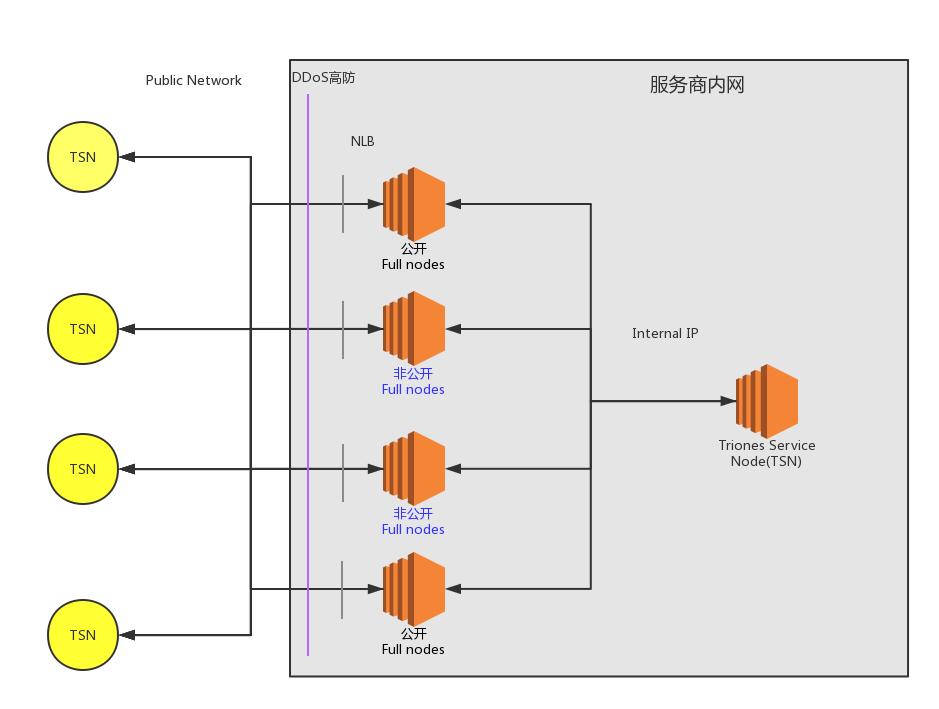
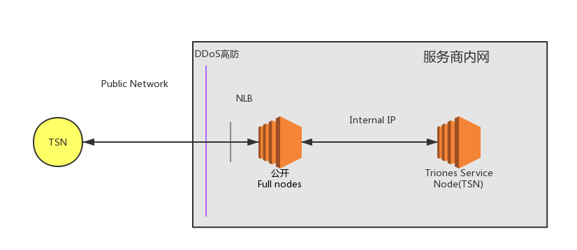
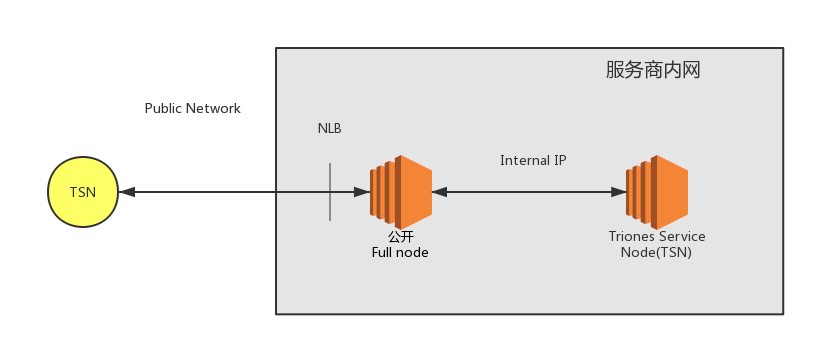
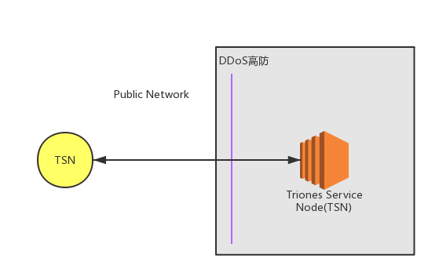

# Ontology Triones Service Node security checklist（本体北斗共识集群安全执行指南）

> by 慢雾安全团队 & Joinsec Team

## 目录

* [架构核心目标](#架构核心目标)
* [面临的主要问题](#面临的主要问题)
* [架构核心设计](#架构核心设计)
* [核心防御](#核心防御)
* [推荐总架构](#推荐总架构)
	* [其它架构](#其它架构)
		* [1. 单链路方案](#1-单链路方案)
		* [2. 多负载方案](#2-多负载方案)
		* [3. 入门级方案](#3-入门级方案)
* [安全加固方案](#安全加固方案)
	* [1. RPC/API 安全](#1-rpc/api-安全)
		* [1.1 屏蔽 RPC/API](#11-屏蔽-rpc/api)
		* [1.2 RPC/API 防护](#12-rpc/api-防护)
	* [2. 命令安全](#2-命令安全)
		* [2.1 密码安全](#21-密码安全)
		* [2.2 开启日志记录](#22-开启日志记录)
		* [2.3 设置最低交易价格](#23-设置最低交易价格)
		* [2.4 并发连接数优化](#24-并发连接数优化)
		* [2.5 非 root 启动 ontology](#25-非-root-启动-ontology)
	* [3. 网络安全](#3-网络安全)
		* [3.1 网络架构](#31-网络架构)
		* [3.2 云服务商](#32-云服务商)
		* [3.3 DDoS 防御](#33-ddos-防御)
	* [4. 主机安全](#4-主机安全)
	* [5. 威胁情报](#5-威胁情报)
	* [6. NormalNode（普通节点）核心安全配置总结](#6-normalnode-普通节点核心安全配置总结)
* [致谢](#致谢)

## 架构核心目标

1. 保护出块服务器正常通信与运行
2. 增强初始主网整体抗攻击能力
3. 保护节点安全

## 面临的主要问题

1. 对初始状态主网进行 DDoS
2. RPC/API 功能被未授权访问及滥用
3. 通信故障

## 架构核心设计

1. TSN 服务器隔离
2. 多跳转节点（小节点流量转发，大节点高防护）
3. 多链路高可用
4. 对比 EOS 架构，适当降低单节点成本，增加整体数量，并保证 TSN 的稳定

## 核心防御

1. 默认关闭 RPC/API 。必须打开时，混淆端口，并架设高防等保护
2. TSN 通信多链路设计
	- TSN 服务器不在公网上暴露，通过跳板服务器（跳板服务器数量要大）进行通信
	- 在外网公布的跳板服务器遭遇持续性攻击时，通过备用链路进行通信
3. 防止全网扫描定位高防后的服务器，修改同步端口 20338 （同理 RPC/API 的 20334-20337 ）至全网最大存活数量的端口 80、443 或 22，这样可以有效抬高攻击者定位成本。

## 推荐总架构

架构说明：

为了应对可能的 DDoS 攻击，节点应准备多条链路，在攻击到来后，可以随时通过备用链路进行通信，确保主网顺利启动，并持续出块。

在没有攻击情况下，外围节点通过对外公布的公开节点进行通信。

### 其它架构
随着主网 TSN 节点的增多，整体的抗攻击能力增强，新增节点在考虑节省成本的情况下可适当降配

#### 1. 单链路方案

#### 2. 多负载方案

#### 3. 入门级方案

## 安全加固方案

### 1. RPC/API 安全

#### 1.1 屏蔽 RPC/API

如无必要，建议禁止 RPC/API 对外访问。

#### 1.2 RPC/API 防护

不建议把节点的 RPC/API 端口直接暴露在公网中，如有暴露的需求请在端口之前添加保护措施

查询用 RPC/API 所在 full node 与 TSN 完全隔离并架设防御，保证外网对 RPC/API 的攻击不能影响到 TSN。

### 2. 命令执行安全

命令详细使用说明可参考官方手册 [Ontology CLI User Guide](https://ontio.github.io/documentation/ontology_cli_sample_zh.html)

#### 2.1 密码安全

`--password, -p`

password 参数用于指定 Ontology 节点启动的账户密码。因为在命令行中输入的账户密码会被保存在系统的日志中，容易造成密码泄露，因此在生产环境中建议不要使用该参数。

#### 2.2 开启日志记录

`--loglevel`

loglevel 参数用于设置 Ontology 输出的日志级别。默认值是1，即只输出 info 级及其之上级别的日志，建设使用默认配置。

#### 2.3 设置最低交易价格

`--gasprice`

gasprice 参数用于设定当前节点交易池接受交易的最低 gasprice ，默认为0，建议设置一个大于零的值以防止交易阻塞攻击。

#### 2.4 并发连接数优化

P2P 端口并发连接数为无限制，可优化`ulimit`系统参数和内核参数，增强恶意连接攻击承受能力。

#### 2.5 非 root 启动 ontology

建议编译完成后，创建普通用户账号，并使用该账号启动 `./ontology`，避免使用 root，降低风险。

#### 2.6 监听随机端口

`--nodeport=PORT1`

`--rpcport=PORT2`

建议设置为非默认端口，如果是对外服务的，建议采用 [主机安全](#4-主机安全) 中的配置方法

### 3. 网络安全

#### 3.1 网络架构

为应对可能的 DDoS 攻击导致节点主网络阻塞的问题，建议提前配置备份网络，例如私密 VPN 网络。

#### 3.2 云服务商

经慢雾安全团队测试，Google Cloud、AWS 及 UCloud 等具有更好的抗 DDoS 攻击的性能，并且在 DDoS 攻击过后服务商不会临时封锁服务器，可以极为快速的恢复网络访问，推荐北斗共识集群使用。（请谨慎选择云服务商，许多云服务商在遭遇 DDoS 等攻击时会直接关闭服务器）

#### 3.3 DDoS 防御

为应对可能发生的 DDoS 攻击，建议北斗共识集群提前配置 Cloudflare、AWS Shield 等 DDoS 高防服务。

### 4. 主机安全

- 防止全网扫描定位高防后的服务器，修改同步端口 20338 （同理 RPC/API 的 20334/20335/20336）至全网最大存活数量的端口 80、443 或 22，这样可以有效抬高攻击者定位成本。
- 关闭不相关的其他服务端口，并在 AWS 或 Google Cloud 上定制严格的安全规则。
- 更改 SSH 默认的 22 端口，配置 SSH 只允许用 key （并对 key 加密）登录，禁止密码登录，并限制访问 SSH 端口的 IP 只能为我方运维 IP。
- 在预算充足的情况下，推荐部署优秀的 HIDS（或者强烈建议参考开源的 OSSEC 相关做法），及时应对服务器被入侵。

### 5. 威胁情报

- 强烈建议做好相关重要日志的采集、储存与分析工作，这些日志包括：RPC/API 与 P2P 端口的完整通信日志、主机的系统日志、节点相关程序的运行日志等。储存与分析工作可以选择自建类似 ELK(ElasticSearch, Logstash, Kibana) 这样的开源方案，也可以购买优秀的商业平台。
- 如果使用了成熟的云服务商，他们的控制台有不少威胁情报相关模块可重点参考，以及时发现异常。
- 当节点出现重大漏洞或相关攻击情报，第一时间启动应急预案，包括灾备策略与升级策略。
- 社区情报互通有无。

### 6. 核心安全配置总结

1. 选用 Google Cloud、AWS 及 UCloud 等可靠的云服务商做节点基础设施，服务器配置在双核4G以上
2. 配置规则禁止与 node 服务不相关的其他服务端口开放（ SSH 只开启证书登陆并限制访问 SSH 端口的 IP 只能为我方运维 IP ）
3. 使用非 root 运行 node 程序，启动时随机指定P2P端口，并且若无必要则不开启 RPC/API

## 致谢

在此非常感谢

* Ontology Team

大力支持节点安全测试，为社区安全积累了宝贵的数据。
